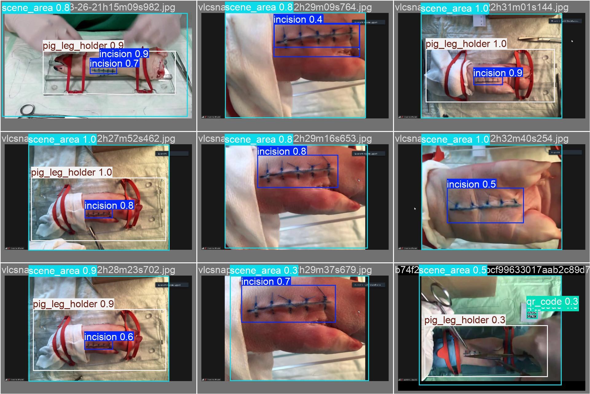

# SurAnVR
VR models for sugrery analysis.

There are two models. 
One is designed to do the detection of objects in static scene (like incision, pig leg holder, ...)
The other is designed to do the detection of objects in dynamic scene (like forceps, needle holder, ...)
The model format is ONNX.

Exaple of prediction with ONNX can be found [here](yolo_ultralytics_onnx_example.ipynb)